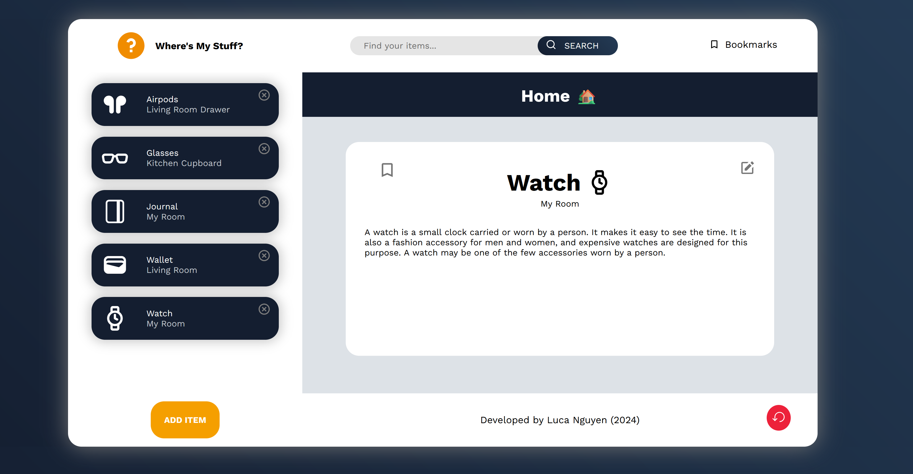

# Where's My Stuff
Organisation app used to track the location of important items. Allows user to log items with detailed descriptions, record precise locations, organise with categories and tags, and find items using a powerful search tool.

## Key features
- Item tracking with location and description management
- Icon selection system with API integration
- Bookmark system for frequently accessed items
- Real-time search functionality
- Persistent storage using localStorage
- Dynamic UI updates and animations

## Technical Implementation Details
| **Feature**          | **Description**                                                                                                                                                                                                                           
|-----------------------|--------------------------------------------------------------------------------------------------------------------------------------------------------------------------------------------------------------------------------------------------|
| **State Management**  | Maintains a state management system through key variables that track current item displays, selected icons, stored items, bookmarks, and API search results. State-driven architecture ensures consistent data handling.                         |
| **Data Persistence**  | Data persistence achieved through `localStorage` integration, which maintains all user data across sessions. The system automatically loads saved data on window initialization and includes a reset feature for clearing stored information when needed. |
| **Search System**     | Search functionality provides real-time, case-insensitive matching across item names and locations. Results update dynamically without page reloads, while the search bar maintains focus state between sessions for improved user experience.  |
| **Icon Integration**  | `Iconify` API integration enables dynamic icon searching and selection. System supports color variants for icons and includes caching for improved performance.                                                                                  |
| **Bookmark System**   | Bookmark feature enables users to flag frequently accessed items for quick reference. System uses a hover-based display mechanism and handles empty states appropriately. Bookmarks persist across sessions and can be toggled easily.           |
| **UI/UX Features**    | UI features smooth transitions and animations, modal forms with overlays, and dynamic content rendering. Loading spinners developed using async operations, while the responsive layout ensures usability across different screen sizes.        |

## How to use

